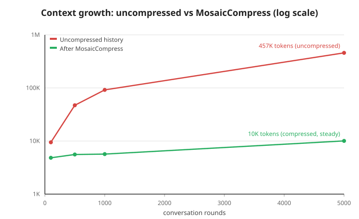

# MosaicCompress

**Stateless dialogue compression based on natural forgetting curve.**

LLM conversations grow linearly. MosaicCompress keeps them bounded — automatically, invisibly, and without the user ever knowing what a "Session" is.

## How It Works

```
Your message array (R rounds, oldest → newest):

Round 1 ────→ Round (R-50)   │ Heavy zone → ALL → 2 msgs
Round (R-49) → Round (R-30)  │ Light zone → distill each, count unchanged
Round (R-29) ──→ Round R     │ Raw zone  → keep as-is
```

**Steady state: constant message count** — `2 + heavyStart × (messages per round)`, e.g. 102 messages for pure two-message rounds, whether at round 60 or round 15,000 (higher, but still constant, when tool-call rounds add messages). The compression ratio approaches 100%.

## Quick Start

```bash
npm install mosaic-compress
```

```typescript
import { mosaicCompress, type MosaicConfig } from 'mosaic-compress';

const config: MosaicConfig = {
  lightStart: 30,    // keep 30 most recent rounds raw
  lightWindow: 10,   // compress every 10 rounds
  heavyStart: 50,    // rounds before this get heavy compression
  heavyWindow: 10,   // same cadence as light
  callLLM: async (systemPrompt, userInput) => {
    // Wire to OpenAI, Anthropic, or any LLM provider
    const res = await openai.chat.completions.create({
      model: 'gpt-4o-mini',
      messages: [
        { role: 'system', content: systemPrompt },
        { role: 'user', content: userInput },
      ],
    });
    return res.choices[0].message.content ?? '';
  },
};

// Call every turn — zero cost below threshold, ~1-2s delay at compression milestones
const compressed = await mosaicCompress(messages, config);
```

## Features

- **Stateless & repeatable** — no session state; call it every turn, and the output can be fed back in as input
- **Zero-cost below threshold** — returns immediately if no compression is due
- **Anti-jitter** — compression only at configurable window boundaries
- **LLM-agnostic** — bring your own `callLLM` function (OpenAI, Anthropic, local models…)
- **Tool-call safe** — tool messages don't break round counting
- **Graceful degradation** — LLM failures don't block the conversation

## API

### `mosaicCompress(messages, config)`

| Param | Type | Description |
|-------|------|-------------|
| `messages` | `Message[]` | Full message array. System prompt at `[0]` is preserved as-is. |
| `config` | `MosaicConfig` | Compression config (see below). |
| **Returns** | `Promise<Message[]>` | Compressed message array. |

### `MosaicConfig`

| Field | Type | Default | Description |
|-------|------|---------|-------------|
| `lightStart` | `number` | `30` | Most recent N rounds kept raw |
| `lightWindow` | `number` | `10` | Anti-jitter: compress every N rounds |
| `heavyStart` | `number` | `50` | Rounds beyond this → Heavy zone |
| `heavyWindow` | `number` | `10` | Anti-jitter for heavy compression |
| `callLLM` | `(sys: string, user: string) => Promise<string>` | *required* | Your LLM call function |
| `onCompress` | `(event: CompressEvent) => void \| Promise<void>` | *optional* | Hook after each compression; receives the original payload for host-side archiving |

### `DEFAULT_CONFIG`

Prefer starting from the exported defaults and overriding only what you need:

```typescript
import { mosaicCompress, DEFAULT_CONFIG, type MosaicConfig } from 'mosaic-compress';

const config: MosaicConfig = { ...DEFAULT_CONFIG, callLLM: async (sys, user) => { /* ... */ } };
```

All numeric fields must be positive integers (windows) / non-negative integers (starts),
and `heavyStart` must be greater than `lightStart`. Invalid configs throw a `TypeError`.

### `Message`

```typescript
interface Message {
  role: 'system' | 'user' | 'assistant' | 'tool';
  content: string;
  tool_call_id?: string;
  tool_calls?: { id: string; type: 'function'; function: { name: string; arguments: string } }[];
}
```

## Design

Read the [full design document (English)](docs/design.md) or [中文设计文档](docs/design.cn.md).

## Architecture Boundaries

MosaicCompress is intentionally **stateless and lossy**:

- **Durable storage is the host's responsibility.** The library compresses
  the message array in place and never persists original payloads. Hosts
  that need lossless history must archive the raw messages themselves —
  through their own code, a database, or the host platform's persistence
  layer (the `onCompress` callback hands every compressed-away original to
  the host for archiving).
- **Compression is lossy by design.** Like any summarization approach, early
  details fade progressively. That is the point: the goal is an unbounded
  conversation, not lossless archival. If exact retrieval of early turns
  matters, pair this library with a persistence layer and re-read on demand.

## Integration Notes

MosaicCompress is host-agnostic and works wherever a `callLLM` function
exists. Its primary integration reference is **DeepSeek Harness**, whose
task-level compaction / output retention / spill complement this library's
message-level compression (roles and order preserved). See the
[Roadmap](docs/ROADMAP.md) for upcoming work.

## Benchmark

A deterministic simulation (zero LLM cost, reproducible) runs the real
algorithm with a rule-based pseudo-LLM. Latest sweep (default parameters):



| Rounds | msgs in | msgs out | tokens in | tokens out | ratio | facts kept |
|---|---:|---:|---:|---:|---:|---:|
| 100 | 234 | 120 | 9,451 | 4,472 | 52.7% | 100% |
| 1,000 | 2,310 | 122 | 91,869 | 5,307 | 94.2% | 100% |
| 5,000 | 11,500 | 120 | 457,484 | 9,805 | 97.9% | 100% |

```bash
npm run bench                        # synthetic sweep: 100 / 500 / 1000 / 5000 rounds
npm run bench -- --file chat.json    # analyze your own conversation file
```

The file mode accepts any JSON array of messages in the library's
`Message` shape and reports the compression ratio:

```json
[{"role": "system", "content": "..."},
 {"role": "user", "content": "..."},
 {"role": "assistant", "content": "..."}]
```

See [benchmark/README.md](benchmark/README.md) for the full method, data
generation, findings and limitations.

## Development

```bash
# Run tests (zero LLM cost — uses mock responses)
npm test

# Type-check the whole project
npm run typecheck

# Or directly:
npx tsx tests/index.test.ts
```

## License

MIT — [TuringCorp](https://www.turingcorp.net) | [iAsk@turingcorp.net](mailto:iAsk@turingcorp.net)